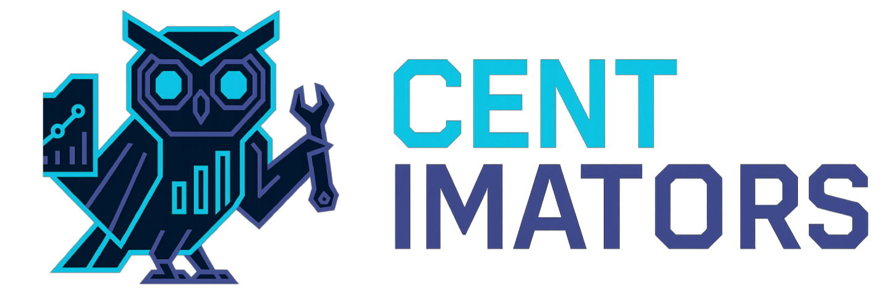

# Centimators: essential data transformers and model estimators for ML and data science competitions

`centimators` is an open-source python library built on scikit-learn, keras, DSPy, and narwhals: designed for building and sharing <mark>dataframe-agnostic</mark> (pandas/polars), <mark>multi-framework</mark> (jax/tf/pytorch/DSPy), <mark>sklearn-style</mark> (fit/transform/predict) transformers, meta-estimators, and machine learning models for data science competitions like Numerai, Kaggle, and the CrowdCent Challenge.

## Built for …

| 🏆 **Competition Data Scientists** | 📊 **Financial-ML Engineers** | ⚡ **Performance Hunters** | 🧠 **Neural Network Architects** |
|------------------------------------|------------------------------|---------------------------|-----------------------------------|
| Iterate fast on Numerai, Kaggle, & CrowdCent submissions without reinventing feature engineering each time. | Production-ready transformers for ranking, lagging, returns, and rolling stats that respect time & group boundaries. | Swap Pandas ↔ Polars with a one-liner, leverage JAX/TF/PyTorch back-ends, and squeeze every millisecond out of your pipeline. | Build and improve upon architectures like bottleneck autoencoders and self-improving neural networks with the same scikit-learn-style API. |

## Key Features
<div class="grid cards" markdown>

-   :material-swap-vertical: **Feature Transformers**
    
    Time-series and cross-sectional transforms that are dataframe-agnostic (Pandas/Polars) and pipeline-ready.
    
    [User Guide](user-guide/feature-transformers.md) · [API](api-reference/feature_transformers.md)

-   :material-ruler: **Model Estimators**
    
    Keras 3 estimators with scikit-learn API (MLP, BottleneckEncoder, LSTM, Transformer, and more) + custom losses.
    
    [User Guide](user-guide/model-estimators.md) · [Losses](api-reference/losses.md) · [API](api-reference/model_estimators.md)

-   :material-brain: **Meta‑Learning**
    
    DSPyMator (LLM-as-estimator) and KerasCortex (LLM-guided architecture search).
    
    [DSPyMator](user-guide/dspymator.md) · [KerasCortex](user-guide/keras-cortex.md)

-   :material-tune: **Advanced Pipelines**
    
    Compose transformers and estimators with metadata routing, CV, and hyperparameter tuning.
    
    [User Guide](user-guide/advanced-pipelines.md)

</div>

!!! tip "Quick install with optional extras"
    - All features (Keras + DSPy + UMAP): `uv add "centimators[all]"`

## Basic Usage

For common transformations like ranking (which groups by date) and lagging (which groups by ticker), use out-of-the-box transformers to create features out of your data, while easily handling group boundaries:

```python
from centimators.feature_transformers import RankTransformer, LagTransformer

# Cross-sectional ranking: rank features within each date
rank_transformer = RankTransformer(feature_names=['close', 'volume'])
ranked_features = rank_transformer.fit_transform(
    df[['close', 'volume']], 
    date_series=df['date']
)

# Time-series lagging: create lagged features within each ticker
lag_transformer = LagTransformer(windows=[1, 5, 10])
lagged_features = lag_transformer.fit_transform(
    df[['close', 'volume']], 
    ticker_series=df['ticker']
)
```

For modeling your features, use centimators's model estimators. A family of Keras-backed estimators are available, including MLPRegressor, BottleneckEncoder, LSTMRegressor for sequences, and always more to come.

```python
from centimators.model_estimators import MLPRegressor, LSTMRegressor

# For tabular data
model = MLPRegressor()
model.fit(df[feature_names], df['target'])

# For sequential/time-series data
lstm = LSTMRegressor(
    lag_windows=[1, 2, 3, 4, 5],
    n_features_per_timestep=len(feature_names),
    lstm_units=[(64, 0.2, 0.1)],
    bidirectional=True
)
lstm.fit(lagged_features, df['target'])
```

## Getting Started

Ready to dive in? Check out our [Installation & Quick Start](installation-quick-start.md) guide to get up and running in minutes.

For comprehensive examples and advanced usage patterns, explore our [User Guide](user-guide/feature-transformers.md) and [Tutorials](tutorials/keras-cortex.ipynb).

## Philosophy

`centimators` makes heavy use of advanced scikit-learn concepts such as metadata routing. This enables powerful workflows where auxiliary data (like dates or tickers) flow seamlessly through complex pipelines to the specific components that need them.

The library is designed for practitioners who need production-ready, composable components for financial machine learning workflows while maintaining compatibility with the broader Python ML ecosystem.
