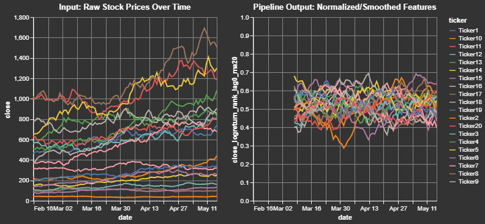
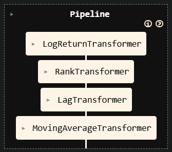
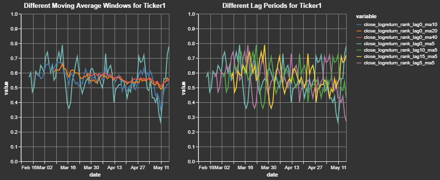
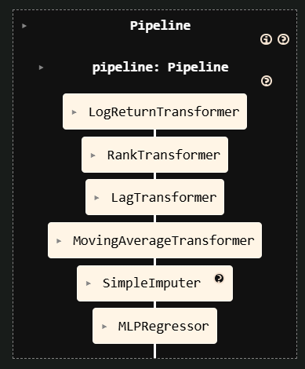

# Advanced Pipelines

`centimators` transformers are designed to work seamlessly within scikit-learn Pipelines, leveraging its metadata routing capabilities. This allows you to pass data like date or ticker series through the pipeline to the specific transformers that need them, while also chaining together multiple transformers. This is useful for building more complex feature pipelines, but also allows for better cross-validation, hyperparameter tuning, and model selection. For example, if you add a Regressor at the end of the pipeline, you can imagine searching over various combinations of lags, moving average windows, and model hyperparameters during the training process.

<div style="text-align: center;">
  
</div>

## Building Feature Pipelines

```python
from sklearn import set_config
from sklearn.pipeline import make_pipeline
from centimators.feature_transformers import (
    LogReturnTransformer,
    RankTransformer,
    LagTransformer,
    MovingAverageTransformer,
)

# Enable metadata routing globally
set_config(enable_metadata_routing=True)

# Define individual transformers with their parameters
log_return_transformer = LogReturnTransformer().set_transform_request(
    ticker_series=True
)
ranker = RankTransformer().set_transform_request(date_series=True)
lag_windows = [0, 5, 10, 15]
lagger = LagTransformer(windows=lag_windows).set_transform_request(
    ticker_series=True
)
ma_windows = [5, 10, 20, 40]
ma_transformer = MovingAverageTransformer(
    windows=ma_windows
).set_transform_request(ticker_series=True)

# Create the pipeline
feature_pipeline = make_pipeline(
    log_return_transformer, ranker, lagger, ma_transformer
)
```

<div style="text-align: center;">
  
</div>

**Explanation:**

- `set_config(enable_metadata_routing=True)` turns on scikit-learn's metadata routing.
- `set_transform_request(metadata_name=True)` on each transformer tells the pipeline that this transformer expects `metadata_name` (e.g., `date_series`).
- When `pipeline.fit_transform(X, date_series=dates, ticker_series=tickers)` is called:
    - The `date_series` is automatically passed to `RankTransformer`.
    - The `ticker_series` is automatically passed to `LagTransformer`, `MovingAverageTransformer`, and `LogReturnTransformer`.
    - The output of `LogReturnTransformer` is passed to `RankTransformer`.
    - The output of `RankTransformer` is passed to `LagTransformer`.
    - The output of `LagTransformer` is passed to `MovingAverageTransformer`.

This allows for complex data transformations where different steps require different auxiliary information, all managed cleanly by the pipeline.

```python
# Now you can use this pipeline with your data
feature_names = ["open", "high", "low", "close"]
transformed_df = feature_pipeline.fit_transform(
    df_pl[feature_names],
    date_series=df_pl["date"],
    ticker_series=df_pl["ticker"],
)
```

We can take a closer look at a sample output for a single ticker and for a single initial feature. This clearly shows how the close price for a cross-sectional dataset is transformed into a log return, ranked (between 0 and 1) by date, and smoothed (moving average windows) by ticker:

<div style="text-align: center;">
  
</div>

## End-to-End Pipeline with an Estimator

The previous section constructed only the *feature engineering* part of a workflow. Thanks to Centimators' Keras-backed estimators you can seamlessly append a model as the final step and train everything through a single `fit` call.

```python
from sklearn.impute import SimpleImputer
from centimators.model_estimators import MLPRegressor

lag_windows = [0, 5, 10, 15]
ma_windows = [5, 10, 20, 40]

mlp_pipeline = make_pipeline(
    feature_pipeline,
    # Replace NaNs created by lagging with a constant value
    SimpleImputer(strategy="constant", fill_value=0.5).set_output(transform="pandas"),
    # Train a neural network in-place
    MLPRegressor().set_fit_request(epochs=True),
)

feature_names = ["open", "high", "low", "close"]

mlp_pipeline.fit(
    df_pl[feature_names],
    df_pl["close"],
    date_series=df_pl["date"],
    ticker_series=df_pl["ticker"],
    epochs=5,
)
```



Just as before, scikit-learn's *metadata routing* ensures that auxiliary inputs (`date_series`, `ticker_series`, `epochs`) are forwarded only to the steps that explicitly requested them.

## Cross-Validation and Hyperparameter Tuning

Because everything follows the scikit-learn API, you can use standard tools for model validation and optimization:

```python
from sklearn.model_selection import GridSearchCV, TimeSeriesSplit

# Define parameter grid for the pipeline
param_grid = {
    'lagTransformer__windows': [[1, 5], [1, 5, 10], [1, 5, 10, 20]],
    'movingaverageTransformer__windows': [[5, 10], [5, 10, 20], [5, 10, 20, 50]],
    'mlpregressor__hidden_units': [(64,), (64, 32), (128, 64)],
    'mlpregressor__dropout_rate': [0.0, 0.1, 0.2],
}

# Use time series cross-validation
tscv = TimeSeriesSplit(n_splits=5)

# Grid search with the pipeline
grid_search = GridSearchCV(
    mlp_pipeline,
    param_grid,
    cv=tscv,
    scoring='neg_mean_squared_error',
    n_jobs=-1
)

# Fit with metadata routing
grid_search.fit(
    df_pl[feature_names],
    df_pl["target"],
    date_series=df_pl["date"],
    ticker_series=df_pl["ticker"],
)

print(f"Best parameters: {grid_search.best_params_}")
print(f"Best score: {grid_search.best_score_}")
```

This allows you to search over various combinations of lag windows, moving average windows, model architectures, and other hyperparameters while maintaining proper time series validation and metadata routing. 