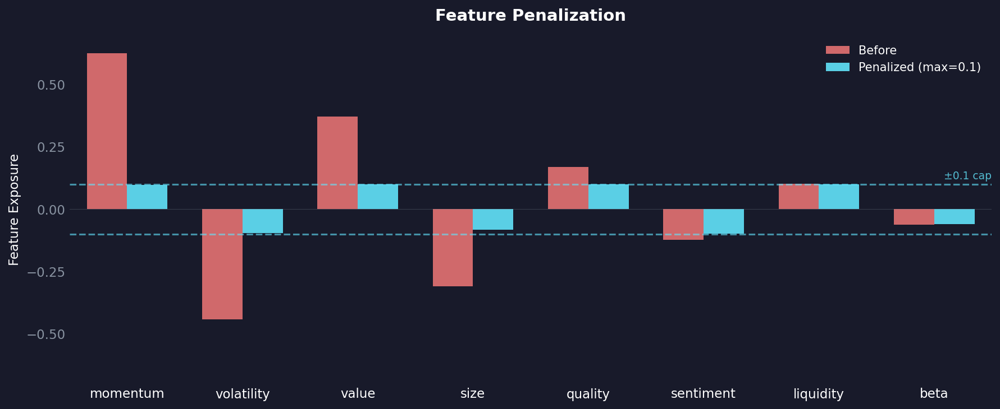

# Feature Transformers

Feature transformers are the backbone of `centimators`, providing scikit-learn compatible transformations that work seamlessly with both Pandas and Polars DataFrames through [narwhals](https://narwhals-dev.github.io/narwhals/). These transformers specialize in time-series and cross-sectional financial data transformations.

All transformers follow the standard scikit-learn API (`fit`, `transform`, `fit_transform`) and support metadata routing for passing auxiliary data like date or ticker series through pipelines.

## RankTransformer

Converts numeric features into their normalized rank within groups (typically by date). This is essential for creating market-neutral features that capture relative performance across assets.

```python
from centimators.feature_transformers import RankTransformer

# Rank features within each date
ranker = RankTransformer(feature_names=['close', 'volume'])
ranked_features = ranker.fit_transform(
    X[['close', 'volume']], 
    date_series=df['date']
)
# Output: close_rank, volume_rank (values between 0 and 1)
```

**Key Features:**

- Normalizes ranks to [0, 1] range
- Handles missing values gracefully
- Groups by any categorical variable (typically dates)

## LagTransformer

Creates lagged (shifted) versions of features within groups (typically by ticker). Essential for exposing temporal patterns to machine learning models.

```python
from centimators.feature_transformers import LagTransformer

# Create multiple lags for each feature
lagger = LagTransformer(
    windows=[1, 5, 10, 20],  # 1-day, 1-week, 2-week, 1-month lags
    feature_names=['close', 'volume']
)
lagged_features = lagger.fit_transform(
    X[['close', 'volume']], 
    ticker_series=df['ticker']
)
# Output: close_lag1, volume_lag1, close_lag5, volume_lag5, etc.
```

**Key Features:**

- Preserves temporal ordering within groups
- Prevents data leakage across different assets
- Configurable lag windows

## MovingAverageTransformer

Computes rolling averages over specified windows within groups. Useful for smoothing noisy signals and creating trend indicators.

```python
from centimators.feature_transformers import MovingAverageTransformer

# Create moving averages with different windows
ma_transformer = MovingAverageTransformer(
    windows=[5, 10, 20, 50],  # Short to long-term trends
    feature_names=['close', 'volume']
)
ma_features = ma_transformer.fit_transform(
    X[['close', 'volume']], 
    ticker_series=df['ticker']
)
# Output: close_ma5, volume_ma5, close_ma10, volume_ma10, etc.
```

**Key Features:**

- Rolling window calculations within groups
- Multiple window sizes in single transformation

## LogReturnTransformer

Computes log returns (first difference of natural logarithm) within groups. The standard way to calculate asset returns while ensuring stationarity.

```python
from centimators.feature_transformers import LogReturnTransformer

# Calculate log returns for price data
log_return_transformer = LogReturnTransformer(feature_names=['close', 'open'])
returns = log_return_transformer.fit_transform(
    X[['close', 'open']], 
    ticker_series=df['ticker']
)
# Output: close_logreturn, open_logreturn
```

## GroupStatsTransformer

Calculates statistical measures across groups of related features horizontally (row-wise). Useful for creating aggregate features from multiple related columns.

```python
from centimators.feature_transformers import GroupStatsTransformer

# Define feature groups and calculate statistics
feature_groups = {
    'price_features': ['open', 'high', 'low', 'close'],
    'volume_features': ['volume', 'dollar_volume']
}

stats_transformer = GroupStatsTransformer(
    feature_group_mapping=feature_groups,
    stats=['mean', 'std', 'skew']  # Choose specific statistics
)

group_stats = stats_transformer.fit_transform(X)
# Output: price_features_groupstats_mean, price_features_groupstats_std, etc.
```

**Available Statistics:**

- `mean`: Average across the group
- `std`: Standard deviation (sample, ddof=1)
- `skew`: Skewness (bias-corrected)
- `kurt`: Excess kurtosis (bias-corrected)
- `range`: Max - Min
- `cv`: Coefficient of variation (std/mean)

## DimReducer

Reduces the dimensionality of features using PCA, t-SNE, or UMAP. Useful for compressing high-dimensional feature spaces, visualization, and removing noise.

```python
from centimators.feature_transformers import DimReducer

# PCA: Fast, linear, preserves global structure
pca_reducer = DimReducer(
    method='pca',
    n_components=10,
    feature_names=['feature1', 'feature2', 'feature3', 'feature4']
)
reduced_features = pca_reducer.fit_transform(X)
# Output: dim_0, dim_1, ..., dim_9

# t-SNE: Non-linear, preserves local structure (good for visualization)
tsne_reducer = DimReducer(
    method='tsne',
    n_components=2,
    random_state=42,
    perplexity=30  # Additional kwargs passed to sklearn.manifold.TSNE
)
viz_features = tsne_reducer.fit_transform(X)
# Output: dim_0, dim_1

# UMAP: Non-linear, preserves local + global structure
# Requires: uv add 'centimators[all]'
umap_reducer = DimReducer(
    method='umap',
    n_components=5,
    random_state=42,
    n_neighbors=15  # Additional kwargs passed to umap.UMAP
)
reduced_features = umap_reducer.fit_transform(X)
# Output: dim_0, dim_1, dim_2, dim_3, dim_4
```

**Available Methods:**

- `pca`: Principal Component Analysis (linear, fast, deterministic)
- `tsne`: t-distributed Stochastic Neighbor Embedding (non-linear, stochastic, visualization)
- `umap`: Uniform Manifold Approximation and Projection (non-linear, balanced, requires `centimators[all]`)

## FeatureNeutralizer

In competitions like Numerai, your model's predictions often correlate with specific features—this is called **feature exposure**. High exposure to any single feature can hurt performance when that feature's predictive power shifts over time.

`FeatureNeutralizer` reduces exposure by subtracting a proportion of the linear relationship between your predictions and the features. Think of it as "de-correlating" your signal from known factors.


The chart shows predictions before (coral) and after (cyan) 50% neutralization.

```python
from centimators.feature_transformers import FeatureNeutralizer

neutralizer = FeatureNeutralizer(
    proportion=0.5,  # How much to neutralize [0, 1]
    pred_name='prediction',
    feature_names=['feature1', 'feature2', 'feature3']
)

neutralized = neutralizer.fit_transform(
    df[['prediction']],
    features=df[['feature1', 'feature2', 'feature3']],
    era_series=df['era']
)
# Output: prediction_neutralized_0.5
```

**How it works:**

1. Gaussianizes predictions within each era
2. Fits a linear model: `prediction ~ features`
3. Subtracts `proportion × exposure` from predictions
4. Re-normalizes to [0, 1]

**Trade-off:** Higher proportion = less feature exposure, but also potentially less signal. At `proportion=1.0`, you remove all linear relationship with features.

## FeaturePenalizer

!!! note "Requires JAX"
    This transformer requires JAX. Install with:
    ```bash
    uv add 'centimators[keras-jax]'
    ```

`FeaturePenalizer` takes a different approach: instead of subtracting a fixed proportion, it uses gradient descent to find the *minimal* adjustment that caps all exposures below a threshold.



The key difference from neutralization: penalization enforces a hard cap (dashed lines at ±0.1). Every cyan bar stays within bounds—the optimizer finds the smallest change needed to achieve this.

```python
from centimators.feature_transformers import FeaturePenalizer

penalizer = FeaturePenalizer(
    max_exposure=0.1,  # Cap exposure at ±0.1
    pred_name='prediction',
    feature_names=['feature1', 'feature2', 'feature3']
)

penalized = penalizer.fit_transform(
    df[['prediction']],
    features=df[['feature1', 'feature2', 'feature3']],
    era_series=df['era']
)
# Output: prediction_penalized_0.1
```


## EmbeddingTransformer

!!! note "Requires DSPy"
    This transformer requires the `dspy` optional dependency. Install with:
    ```bash
    uv add 'centimators[dspy]'
    ```

Embeds text and categorical features into dense vector representations using [DSPy's Embedder](https://dspy.ai/api/models/Embedder/). Supports both hosted embedding models (OpenAI, Cohere, etc.) and custom local models.

### Basic Text Embedding

```python
from centimators.feature_transformers import EmbeddingTransformer

# Using a hosted model
embedder = EmbeddingTransformer(
    model="openai/text-embedding-3-small",
    feature_names=['news_headline', 'company_description']
)

embedded_features = embedder.fit_transform(df[['news_headline', 'company_description']])
# Output: news_headline_embed_0, news_headline_embed_1, ..., news_headline_embed_1535
#         company_description_embed_0, company_description_embed_1, ..., etc.
```

### Local Model (Sentence Transformers)

```python
from sentence_transformers import SentenceTransformer

# Load a local embedding model
model = SentenceTransformer('all-MiniLM-L6-v2')

embedder = EmbeddingTransformer(
    model=model.encode,  # Pass the encode function
    feature_names=['text_column'],
    batch_size=100
)

embedded_features = embedder.fit_transform(df[['text_column']])
# Output: text_column_embed_0, text_column_embed_1, ..., text_column_embed_383
```

### Custom Embedding Function

```python
import numpy as np

def custom_embedder(texts):
    """Custom embedding function - must return numpy array."""
    # Your custom logic here
    embeddings = your_model.embed(texts)
    return np.array(embeddings, dtype=np.float32)

embedder = EmbeddingTransformer(
    model=custom_embedder,
    feature_names=['text_feature']
)
```

**Key Features:**

- Supports both hosted (via litellm) and local embedding models
- Handles null values (fills with zero vectors)
- Automatically expands embeddings into sklearn-compatible columns
- Backend-agnostic (works with Polars, Pandas)
- Configurable batch size and caching for hosted models

## Pipeline Integration

All transformers work seamlessly in scikit-learn pipelines with metadata routing:

```python
from sklearn import set_config
from sklearn.pipeline import make_pipeline

# Enable metadata routing
set_config(enable_metadata_routing=True)

# Create pipeline with multiple transformers
pipeline = make_pipeline(
    LogReturnTransformer().set_transform_request(ticker_series=True),
    RankTransformer().set_transform_request(date_series=True),
    LagTransformer(windows=[1, 5, 10]).set_transform_request(ticker_series=True),
    MovingAverageTransformer(windows=[5, 20]).set_transform_request(ticker_series=True)
)

# Transform data with metadata routing
transformed = pipeline.fit_transform(
    df[['close', 'volume']],
    date_series=df['date'],
    ticker_series=df['ticker']
)
```

**Metadata Routing:**

- `date_series`: Used by `RankTransformer` for cross-sectional ranking
- `ticker_series`: Used by temporal transformers (`LagTransformer`, `MovingAverageTransformer`, `LogReturnTransformer`) to maintain asset boundaries
- `era_series`: Used by `FeatureNeutralizer` and `FeaturePenalizer` to process predictions era-by-era
- `features`: Used by `FeatureNeutralizer` and `FeaturePenalizer` for exposure calculation